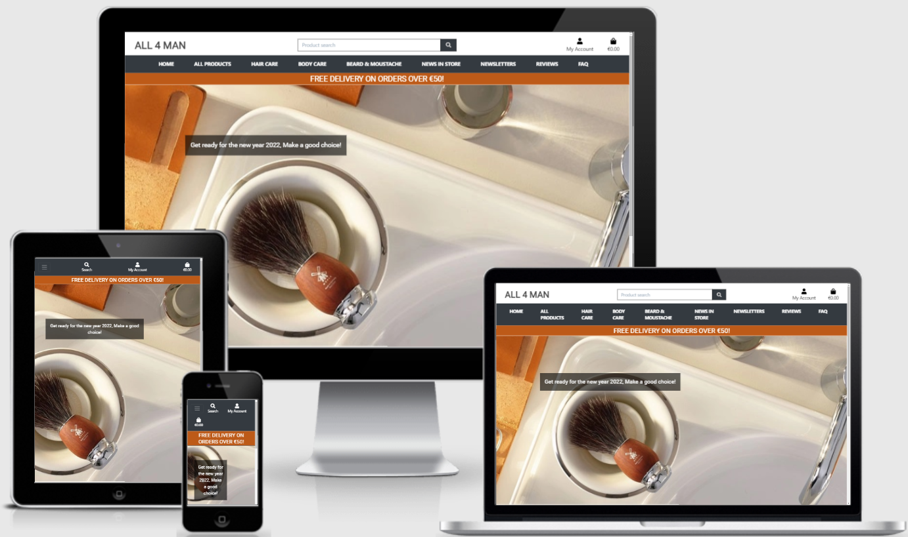

# Code Institute MS4
## 
  ALL FOR MAN 

You can visit my website live [here](https://all-for-man.herokuapp.com/)

# General Information
<h2> Brief overview of the project </h2>

 The latest project has been created and completed for the Diploma in Full Stack Software Development at Code Institute with the latest technologies and programming languages ​​such as HTML, CSS, JavaScript, Python + Django, MySQL, Postgres, Stripe and any additional libraries and external APIs.. Its goal was to create an integrated website from start to finish.. During which the visitor purchases and pays smoothly, and this happened through a central data set that provides an authentication mechanism between the site and the visitor.

# Table of Contents:

- [Introduction](#introductions)
- [Scope](#scope)
- [User Experience](#ux)
- [Design](#design)
- [Features](#features)
- [Technologies Used](#technologies-used)
- [Database Design](#database-design)
- [Testing](#testing)
- [Deployment](#deployment)
- [Credits](#credits)
- [Acknowledgements](#acknowledgements)

# **Introductions**
## A website **ALL FOR MAN **: 
 Has been created the fourth project with the latest and newest technologies and programming languages ​​in order to attract all men, adults and youth, especially those who love themselves and are interested in aesthetics and elegance. We offer them, through this website, the latest and most important local and international products, starting from hair care to the beard and even the skin care. From my point of view, the topic of the project is one of the most important topics that are currently being dealt with inside and outside Sweden. We have an increase and attract a large number of men in this field. In addition, it is an integrated site with features from its beginning to its end ... It allows the visitor to become a permanent customer for us by registering on the site ... And it allows all our valued customers to present their opinions and ideas with all the services the site deals with ...*products*... *service Customers* and others. In addition to allowing the customer to present any problem he faces, if it is a personal problem and needs advice from our experts and our cosmetic specialists, or regarding any problem he faces on the site, we are all here to help and guide them.

## Website business goals:
 - Establishing a global brand in the field of cosmetics.
 - Create an integrated site that allows the visitor to navigate, register and pay in reliable ways.
 - Creating a site that will start spreading in my country Sweden first and gradually it will start to become famous worldwide.
 - Attracting all men's groups through the site's social networking sites.
 - The site user makes it easy for him to publish his opinion, ideas, and even suggestions and problems.

# Scope
This is the **Fourth project** as it relies on the latest technologies and programming languages, making the site more interactive and easier to deal with users, and this is the main goal of it. The project consists of **HTML 5**, **Stylesheet CSS**, **Jquery**, **Python language**, **Django**, **MySQL**, **Postgres Database**, **Heroku CI/CD**, and **Amazon services S3**.

# UX
## User stories
<h3>I will present different goals and capture different characters. If Iam a developer, site owner and user, what are the important goals for each person individually?</h3>

### Developer goals:
 - As a developer I want to create an integrated and beautiful website in terms of:
    - Display beautiful, good and high quality products.
    - The way of how can presented the products to the visitor.
 - How skillful is this developer in communicating with customers in terms of presentation and attention grabbing.
 - It is very important for the developer to increase the number of sales and inflate profits for the owner of the site.
 - It is very important to have a complete aesthetics website with good use of HTML, CSS and Bootstrap.
 - It is very important that the site operates with complete reliability to encourage the visitor to purchase through the developer's good use of Javascript, Python and Stripe.
 - It is very important for the developer to store all his effort and work in a solid database as two types of databases have been used:
    - The first SQLite3 during the site creation phase.
    - The second is PostgreSQL when publishing and live viewing.

### Owner site goals:
#### As the owner of the site, the responsibility is very high
 - In terms of choosing good, effective and high-quality products.
 - I will be able to offer as many products as possible of different types and in large quantities to be available to the customer without making him wait for long.
 -  Sending the products to the customer after confirming the purchase. An offer has been made to our customers about the possibility of shipping the products for free without paying the shipping fees if the condition that was specified on the site is achieved.
 - How to delight the customer with products and also provide the best service.
 - As owner its very important for me to have the ability to add new products all the time.
 - Have the ability to delete products that are expired or unattractive to the customers.
 - Have the ability to edit any product displayed on my website.
 - I will have the ability to always communicate with my clients by publishing the most important and latest news regarding cosmetics in order to return the benefit to the client and also the ability to edit or delete the news.
 - I have the ability to respond to all customer questions and inform them immediately.
 - It is important to see the opinions of customers posted on the site regarding all products or services, so that I can improve and develop them.
 - As a site owner, I want to be able to collect payments through the site.

 ### As a **New Visitor**:
  - I want to understand the content and purpose of the site with great flexibility.
  - I want to navigate the pages of the site easily to understand the content and reach my goal.
  - I want to have a website that can be browsed easily and clearly with different sizes of electronic devices, which makes me want to visit the site frequently.
  - I want to browse all the products published on the site with pleasure through the pictures, colors and fonts used on the site by the developer.
  - I want to search for my favorite product through a search bar easily and easy to access the required product.
  - The visitor's interest in seeing an integrated and comprehensive site for all the information.
  - I want to be able to make a purchase without needing to register on the site. 
  - I want to be able to view all the products available, and also filter the view by category name, price, rates and products name.
  - I want to have the ability to read people's opinions on everything about the site.
  - I want to have the ability to identify people's problems and read the responses of specialists to get to know their capabilities more.
  - I want to have the ability to read the news published on the site through specialists and owners.
  - I want to be able to view more details about each product by clicking on it.
  - I want to be able to easy add a products to my shopping bag.
  - I want to be able to know the total amount of the bag and add/remove items from the bag before checking out.

### As a **Frequent Visitor**:
  - I want to find in the site an easy-to-use electronic search engine that will allow me to reach my goal smoothly.
  - I want to find the most important and newest products.
  - I want to communicate directly with the specialist through the social media.
  - I want to register my on the site easily.
  - I want to add my reviews about the products and services easily.
  - I want to have my own profile page.
  - I want all my personal data to be stored in my profile.
  - I want to be able to change my personal information such as address, phone number, or anything else.
  - I want to receive confirmation emails.
  - I want to be able to store all my purchases in my personal page and be able to view and view the old of them with one click.
  - I want to receive a confirmation message that I have been registered on the site
  - I want to receive a confirmation message after confirming the purchase
  - I want to easily navigate the site and browse the posted products.
  - I want to browse the site in different sizes smoothly like big screen device, mobile, labtop and on the others devices.
  - I want to find the most famous products in the world through this site.
  - I want to be able to browse the site and search by keyword.
  - I want to be able to log in and out of the site.
  - I want to be able to see all available products, and also filter the offer by category, price, rate and products name.
  - I want to be able to view more details about each product by clicking on it.
  - I want to be able to easily navigate to my shopping bag and see which products I have added to it.
  - I want to be able to know the total amount of the bag and add/remove items from the bag before checking out.
  - I want to be able to add a review on the website.
  - I want to be able to edit to my review that I have posted on the website.
  - I want to be able to add a question I want to ask the owner of the site or one of the beauticians.
  - I want to receive a response and be able to read the response to my issue in a proper and smooth manner.
  - I want to be able to view useful content such as newsletters.
  
[Back to Table of contents](#table-of-contents)

# Design
## Project definition
  - The purpose of the site design ... In addition, it is the fourth and final project in the long and enjoyable way that I have crossed at the Code Institute Where it built in me a great challenge with codes and a greater passion in how to communicate with each code and brought me a very great benefit scientifically.
  But there is another goal in building a website specialized in cosmetics for men, as it is one of the projects that I want to achieve. It is owning a private project and expanding it to reach the world, and the topic covered by the site is closely related to the family, because many of us are beauticians and hairdressers, and for this I wanted to achieve my dream and the dream of my family.
  Due to the nature of the site and the target audience, which is the category of men . I used colors that are appropriate and close to the tastes of men in order to be able to attract them.
  As the colors that I used are wonderful colors and are a source of joy and the customer is eager to buy.
  I'll explain it in the color scheme.

## color scheme
This site was created on four main colors, ** black... dark gray... white and orange **,
Because they are the favorite colors of men and fit a lot with the type of products displayed on my website.
The reasons:
   1. Comfortable to the eye, which attracts the visitor to browse the site with a great desire.
   2. The orange color(*#bd5a18*) was inspired by the main image displayed on the front of the site as it merged and coordinated with the image wonderfully.
   3. Black and dark gray(*#000*, *#494949*) was used as the main color on the site because it reflects the black color, which is the master of colors and suits the taste of men. In addition to the dark gray, I used it as a base color in creating a logo for the site.
   4. White to open the page and give it beautiful glasses and movement, which attracts the viewer's attention.

## Typography
  - **Roboto font**: Is the main font used throughout the site with **Sans Serif** as the backup font In case the font isn't imported properly into the site for any reason from the google fonts, this font that I've used on all my pages is nice and clean font that's frequently used in programming, so it's attractive and appropriate.
  - The source for the inspired font is [Google Fonts](https://fonts.google.com/)

## Wireframe
  - All wireframes pages were created by mockflow-wireframe.I made a simple and concise layout of must of pages that I had created in the project, which are **Home, Product, Product-detail, Newsletters, Reviews, FAQ, Question-answer, View-question, Checkout, Checkout-success, Bag**.
   The wireframes can be found here:
   - [Home-Wireframe](https://github.com/farah1979/all-for-man/blob/main/home-wireframe.png)
   - [Products-Wireframe](https://github.com/farah1979/all-for-man/blob/main/products-wireframe.png)
   - [Product-detail-Wireframe](https://github.com/farah1979/all-for-man/blob/main/product-detail-wireframe.png)
   - [Newsletter-Wireframe](https://github.com/farah1979/all-for-man/blob/main/newsletters-wireframe.png)
   - [Reviews-Wireframe](https://github.com/farah1979/all-for-man/blob/main/reviews-wireframe.png)
   - [Questions-Wireframe](https://github.com/farah1979/all-for-man/blob/main/questions-wireframe.png)
   - [Question-Answer-Wireframe](https://github.com/farah1979/all-for-man/blob/main/questions-answer-wireframe.png)
   - [View-question-Wireframe](https://github.com/farah1979/all-for-man/blob/main/questions-view-wireframe.png)
   - [Bag-Wireframe](https://github.com/farah1979/all-for-man/blob/main/bag-page-wireframe.png)
   - [Checkout-Wireframe](https://github.com/farah1979/all-for-man/blob/main/checkout-wireframe.png)
   - [Ckhekcout-success-Wireframe](https://github.com/farah1979/all-for-man/blob/main/checkout-success-wireframe.png)

## Imagery

All product images, data, and even prices are real and were taken from different suppliers that I have previously dealt with them.
The site's logo is inspired by the developer's imagination, as it is the logo that I will adopt on my site, which I think and plan to develop further and make it spread throughout Sweden first and the world second.
As for the images which published on the News and reviews page, they were taken after a continuous search on Google
Examples of sites:

 [Google](https://www.google.com)

[Back to Table of contents](#table-of-contents)

# Features
**Home Page**

  The home page of the site is very simple and beautiful, which attracts the visitor and allowed him to browe the site smoothly.
  This page is divided into two parts section 
  First one:
It consists of a large image that gives a general idea and content of the site. Inside the image there is a button link with welcome title that takes the visitor to the all products page which displayed on the site.  
  second section: 
Includes two links for the visitor: 
  - The first link:
To new products page only which newly added to the site and below the link in the home page, the visitor can see all the new products, Where each product is known individually by its name, price and rating. Then with one click on the product image or name he can directly enter the product detail page and find out more data about this product and from there he can add to the shopping cart to buy the product.
  - The second link:
  It is a button link at the bottom of the page, where after clicking on it, the visitor goes to the page of all the products displayed on the site and sees a lot of products of various types, prices and categories.
 -  [view the home page](https://all-for-man.herokuapp.com/)

**All Products Page**.

A page displaying all products where the visitor could arrange them to facilitate the search for his order based on the price, where he could arrange the products from cheapest to most expensive, or by rating from least to most, or by category name where it could be arranged alphabetically.  
I used **Bootstrap 4** to put each product into a special card that includes this card
  - Product Image
  - product price
  - Product category
  -  Rating with star icon

With the help of the Python and Jinja language, the products were displayed easily, and each of them had its own place with its own data. All the products were added by the developer, who is at the same time the admin, and they were added manually on the admin page and through programming they were presented to the viewer with this beauty and elegance. 
Each card has its own clicking, which means that the visitor is allowed to simply click on the product card and enter the product detail page, where more details about this product will be shown to him.  
The visitor can click on the existing category within the card, through which he can go to this category and see all the products belonging to the same category. 
If the user is a SuperUser, the ‘Edit’ and ‘Delete’ links are displayed to allow easy management of products.
 -  [view the all products page](https://all-for-man.herokuapp.com/products/)

**Product Detail Page**

Here the product is displayed where the visitor will see the details of this product, namely:
  - **A large image**of the product . Here the viewer can click on the image, as a new tab will open that review the image of the product more biggest than what is displayed on the product detail page.
  - **Product name**
  - **Product price**
  - **Category name** Here the viewer can click on the name of the category, and a new page will open for this category that includes all the products of the same category
  - **Rating**
  - **Quantity**... here the viewer can put the quantity that he supports his purchase of this product, as it is a quantity that was determined by the developer by using *JavaScript* from 1 to 99.
  - Then he can click on **Add to Bag** button to add this product to the shopping cart, then a **success message** will appear at the top of the page telling him that this product has been added successfully, after that he will have the option to either go to the bag page to confirm the purchase or click on the **keep shopping** button if desired, and after pressing on that button the buyer will go to the products page again to be able to choose another product
  - Before all this, the buyer can get to know the product more after reading the contents of the product, as there are 3 fields below the product image. One of them is the product **description**, where a detailed explanation of this product has been put. The second is the area of ​​**delivery** of this product to the buyer, which is the expected period from the seller to the buyer. And the last field is the **volym**, through which he can know the **size(volym)** of this product that the buyer wanted to buy.
  - This page also includes a link that the viewer can click to get to the page displaying customers' reviews about our site..our products and services or anything else that the customer would like to express his opinion about.
  - This page also includes **related products** field which display some of the products to the same category, where determined only 4 related products of the same category were brought in. May be the customer would like to see them and take a look at them and they are presented in the form of a product image with the product name, price and rating, where the customer can click on any product that has caught his attention and will then navigate to the page of this product.
  - [view the product detail page](https://all-for-man.herokuapp.com/products/33/)

**Newsletter Page**
  The user can see a beautiful image related to the topic of the page in addition to the text of the title and introduction.
  - The visitor can read all the news that was added by the admin or superuser.
  - Here all the news that the admin or superuser would like to display to customers to know the latest news and products in the world of cosmetics are displayed.
  - If the user is an admin or a superuser, he can, after login in the site, add any new news he wants to add or modify any news that was previously published.
  - The visitor can see the news in the form of a follow-up card for each news that contains the name of the news ... the content .. the date of the news's presentation and the last by who had added this news.
  - If the user is an admin or a superuser, he can see the edit button and the delete button in the news card
  - [view the newsletters page](https://all-for-man.herokuapp.com/newsletters/)

**Reviews Page**
  - The user can see a beautiful image related to the topic of the page in addition to the text of the introduction.
  - The visitor can read all the reviews that was added by the authenticated user.
  - Here all the reviews that the authenticated user added to review his opinion about the site, service or anything else he wants to express his opinion about are displayed.
  - If the user is authenticated, after login in the site, he can add any review he wants to add in our site
  - If the user is authenticated, after confirming the login, he can edit on any opinion previously added by him.
  - If the user is an admin or a superuser, he will see in the review card, two buttons, one of them is edit button and the other is delete button.
  - The visitor can see the reviews in the form of a follow-up card for each review containing the name of the review... content .. the date of the review presentation and the last user name who added this review.
  - If the user is authenticated, and after confirming his entry to the site, he can see the edit button in the review card. Through it he can click on it and then he will go to the page to edit the review where it will appear the form with all the old data and here he can either modify it or cancel.
  - On the edit  page, here are two buttons, one of which is “Edit” After the modification, he will return to the same view reviews page, and a success message will appear to him, including that the review has been editing Or the cancel button and it will return to the same view reviews page without any message appearing.
  - [view the reviews page](https://all-for-man.herokuapp.com/reviews/)

**FQA Page**
  - The visitor can see a title, introductory text, and a series of arranged question cards.
  - The visitor can read any question added by the authenticated user.
  - Each card added to the question page contains the name of the question, date and by whom this question was published.
  - Every visitor who wants to see the content of the question and the answer to the question displayed on the page can click on the question title and thus take him to the question views page.
  - On the views question page the visitor can see the question and the answer in all its details if this question is answered by the superuser, or he can see the question displayed in details and below a message from the admin, says the question has not yet been answered.
  - If the user is a authenticated user, they can click Edit on each how-to post which takes them to a page with a pre-filled edit form, where they can edit the post.
  - If the user is a superuser, clicking on both of the edit if he want to edit the question or answers or on the delete on each how-to post will remove the post from the page (and database).
  - Only the superuser can answer any question asked by the authenticated user after entering (Login)the site.
  - [view the quetions page](https://all-for-man.herokuapp.com/questions/)

**Bag Page**
  - Here, all the products that have been added by the user will be displayed, including the product image, name, price, and the quantity that was added to the shopping bag.
  - The buyer can click on the product image if he wants to see the product again more clearly.
  - The buyer can click on the name of the product, which will take him back to the product detail page if he wants to read again about the product, including the contents.
  - The user can change the quantity of the product in the bag using the increase or decrease icons.
  - If the quantity of the product has been changed, he can press the edit button to be adjusted to the quantity correctly.
  - The buyer can remove the product from the bag if his opinion of the purchase is changed.
  - at the end of the page will appear the total amount of his bag, including the costs of delivering if he does not meet the condition at the top of the page regarding the amount of delivery.
  - The condition is that if the user reaches the amount over 50 euros, the goods will be sent to him for free. This is a service that was added by the developer.
  At the end of the page, the user will see two buttons, one of them is to go to the confirmation of purchase (Chekout page), and the other is a button that, if pressed, will take it back to the products page if the user wants to continue shopping.
  - [view the bag page](https://all-for-man.herokuapp.com/bag/)

**Checkout Page**
  - This page is divided into two parts.
     - The first is to display a form that will be filled out by the user.
     - The second is a summary of the order.
  - The user must fill out and complete the form with his real data to achieve the checkout process and receive the purchase confirmation message
  - The user must enter his purchase card with his details, otherwise the purchase process will not be completed correctly
  - At the bottom of the form, there is an option for the user to either save the information order in his profile page so that he can view it if he wants and at any time he wants, and this is after confirming the entry to the site or continuing to confirm the exit without saving the data.
  - **STRIPE** provides credit card validation in the credit card field of the form.
  - The second field displayed on the page is for product details and the total amount.
  - Once the user presses the button to complete the order, an opaque screen will appear to show that the payment is being processed.
  - The user can click on the adjust bag button, as it will transfer it to the bag page if he wants to modify something or add another product.
  - [view the checkout page](https://all-for-man.herokuapp.com/checkout/) will appear if there is some products in the bag page.
  

**Checkout Success Page**
  - A summary is presented to the user of the purchase process and all the details related to the purchase, including the name of the product, the date of purchase, the address to which the goods will be sent, and the full amount details.
  - As soon as the user enters this page, it means that the purchase was made successfully, a success message will appear at the top of the site.
  - This Success toat message informs the user that all purchase data will be sent to the email which entered by the user on the checkout page.
  - Finally, there is a button at the bottom of the page, where it takes the user to see all the new products that have been recently added to the site.
  

**Product Management Page**
  - Only Superuser can view this page in the Navbar, he can click on Product managment link and this will navigate him to the Adding product page.
  - A form will appear to the Superuser that includes filling it out with all the product data of the Category..SKU..Product name..Discription..Price..Volym(size)..Rating..Finally, it allows him to add an image of the product.
  - Two buttons will appear at the bottom of the form, either the add a product button, and thus he will confirm his desire to add this product to the site, or the cancel button, which will take it directly to the page of the products displayed on the site.
  - [view the product managment page](https://all-for-man.herokuapp.com/products/add/) will appear after login as as superuser

**My Profile Page**
  - Only the authenticated user can create the profile page.
  - If any visitor wishes to have a personal page, he must first register on the site through the registration link in the Navbar.
  - Within their profile page, the user can view their default delivery information if they choose to add this.
  - User can also view order history, including order number, order issue date, items purchased and total order cost.
  - By clicking on any order history number that was stored in his profile page, the user will go to see the details of the old order.
  - As soon as he enters this page, an info toat message will appear to him that this order is old and was previously sent to the user's email.
  At the bottom of the old order view page, there is a button that can be clicked to return the user to the profile page.
  - [view the profile page](https://all-for-man.herokuapp.com/profile/) will appear after login as as an authenticated user

**Register Page**
  - If the visitor wishes to register on the site, he must click on the registration link located at the top of the page in the Nav bar.
  - This page contains a form that must be filled out correctly, otherwise registration will not be completed
  - This page contains a form that must be filled out correctly, or the registration will not be done.
  - The email will be entered twice to confirm that it was entered correctly.
  - Username and password twice to confirm that the password was entered correctly.
  - At the bottom of the page, click on the Register button.
  - He will then be taken to the confirmation page and an email will be sent to him to be able to confirm his registration on the site.
  - After performing the confirmation process, the user can log in to the site successfully, and a successful registration message will appear at the top of the page.
  - If the user enters wrong data, a message will appear to correct the error.
  - And if the user has a previous account, he can click on the login link on the top of the form to go to the login page of the site.
  - [view the register page](https://all-for-man.herokuapp.com/accounts/signup/) 

**Login Page**
  - It is a link located at the top of the page in the navbar that is clicked to enter the login page to the site.
  - The user will enter his name and password correctly.
  - If it is entered incorrectly, a message will appear and he must correct the error so that he can enter the site.
  - Below the data entry process, here is an option if the user wants to save his entry, and thus it will be easier to login next time.
  - At the bottom of the page there are two buttons, either the login button to enter the site or the home button, where the user will return to the main page of the site without entering the site.
  - There is a link that if the user forgot the password, he will be able to click on it and he will go to the confirmation page for forgetting the password so that the admin will send him a new password through which he can enter the site.
  - At the top of the page is the registration link if the user wishes to register.
  - [view the login page](https://all-for-man.herokuapp.com/accounts/login/) 

**Logout Page**
  - It is a link located at the top of the page in the navbar that is clicked to enter the login page to the site.
  - This page can only be accessed by users that are authenticated.
  - Once signed out, users are redirected back to the Home page and they can no longer view their My Profile page.
  - Once the user logs out of the account, he was unable to enjoy any feature that was added to him as an authenticated user, such as adding a question or review.
  - As soon as you log out of the account, a success message will appear to him that you have been successfully logged out.
  - [view the logout page](https://all-for-man.herokuapp.com/accounts/logout/) 

 

**Navbar**
  - It is a navigation bar that appears at the top of the site and on all pages and the purpose of the navigation bar is to facilitate the visitor to navigate between the different pages on the site easily and it is divided into several links.
    1.  Link to view all products in Bootstrap drop down form.
    2. Three links with the different name of categories for different types of beauty products in the form of a drop-down list, and each list appear what it contains of products belonging to this category.
    3. A link to a category that only displays everything new that has been added to the site.
    4. The newsletters link, which is also a drop-down list, where by clicking
will navigate the user to news page and all visitors have the ability to see the news displayed on the site. The other link is to add news and here it will appear only for the superuser to be able to add new news to the site.
   5. Reviews link, and here a drop-down list will appear with two links of two pages, one a link to display all reviews, and they are available to all users. The other link is to add an review page, and it is only for the authenticated user after login the site to be able to add an review.
   6. The last link is the question and here you will see two links for two different pages.. The link will navigate the user to questions page to see all questions  and it is available to all visitors to the site. The other link is to Ask a Question page and it is intended only for the authenticated user after login the site to be able to add that a question he wanted to present to the admin.

**Footer**
  - The footer is divided into two parts for aesthetic reasons, as they have two different background colors. One contains social media icons with links to social media pages that open in a new page, it is located on the right side of the footer and on the left side, correct data has been set for the admin in order to communicate with him when needed, and at the end of the footer I puted Copyright.
  - I have linked all the social media links regarding the family business to get to know us more and to know how to use the products.
  - Linkedin link is under construction and we have not put a link to it at the moment.

[Back to Table of contents](#table-of-contents)

# Technologies Used
## Languages Used, Frameworks and tools and resources:
  - [HTML5](https://en.wikipedia.org/wiki/HTML5)/ Used for build the site structure
  - [CSS3](https://en.wikipedia.org/wiki/CSS)/ used to styling the site
  - [Jquery](https://en.wikipedia.org/wiki/JQuery)/ used to interactive the site
  - [Python](https://www.python.org/) /used to write the site logicaly
  - [Django](https://www.djangoproject.com/) /this web framework which helped us to build all the apps in the site
  - [Jinja](https://jinja.palletsprojects.com/en/3.0.x/) /is a web template engine for the Python programming language
  - [Font-Awesome](https://fontawesome.com/icons?d=gallery)/ these icons used on this site
  - [Google fonts](https://fonts.google.com/) / the font **Roboto** which used in the site
  - [Bootstrap](https://getbootstrap.com/) /this was used for its responsive grid framework, toasts, cards, navbar and buttons.
  - [Django Crispy Forms](https://django-crispy-forms.readthedocs.io/en/latest/) /used to build our forms in the site
  - [SQLite](https://docs.djangoproject.com/en/3.2/ref/databases/#sqlite-notes)/this database used duing build our site in the local git.
  - [PostgresSQL](https://www.heroku.com/postgres)/ this database used to deployment our project and its offerd by heroku.
  - [Gunicorn](https://gunicorn.org/) / the Python WSGI (Web Server Gateway Interface), HTTP Server used in deployment to Heroku.
  - [Psycopg2](https://pypi.org/project/psycopg2/) /used to adept python to Postgres database.
  - [Gitpod](https://www.gitpod.io/)/ used during build our site and its IDE for adding code.
  - [Git Version Control](https://git-scm.com/) / Version control to track and push codes to github
  - [GitHub](https://github.com/) / remote repository
  - [Heroku](https://www.heroku.com/home) / which used to depoly our site
  - [Stripe](https://stripe.com/gb) / This ecommerce payment system was used for the site payment facilities.
  - [Code Institute Course Content Boutique Ado](https://www.codeinstitute.net/) / this project is help me to build my project.
  - [Stack Overflow](https://stackoverflow.com/) / used when I interface an issue
  - [W3C Schools](https://www.w3schools.com/) / used when I interface an issue
  - [youtube](https://www.youtube.com/hashtag/djangosearch) /This tutor has helped me somewhat in solving some problems

## Database Design
  - There are two databases that were used in the project
    - The first is Sqlite3, which is a virtual database that comes automatically after you install the django app. It was used throughout the construction period of the project
    - The second is PostgreSql, which is the database provided by Heroku that was used to deploy our project.
  - In the event of adding any new code to the project in git IDE then we must add, comment and push to Github and then automatically the code will be added to the page which deployed in heroku.
  - Django Allauth, specifically `django.contrib.auth.models` provided the **User** model that is used in the Profile App.
  - Django helped us a lot and made it easy for us to install any app we want to add to the site.
  - When you install any app by using python3 manage.py startapp (app name), it will come with a package of files, including:
    - Models, Admin, Test, View, apps and each file has a specific role.
  - With the help of the code institute Boutiq ado, many apps have been created, including the Home, Products, Profiles, Bag and checkout.
  - As the developer, I created 3 additional applications for the site, which are: Questions, Newsletters and Reviews.

### Products App:
#### Product Model

| Name        | Database Key | Field Type    | Type Validation                                              |
| ----------- | ------------ | ------------- | ------------------------------------------------------------ |
| Category    | category     | ForeignKey    | "Category", null=True, blank=True, on_delete=models.SET_NULL |
| SKU         | sku          | CharField     | max_length=254, null=True, blank=True                        |
| Name        | name         | CharField     | max_length=254                                               |
| Description | description  | TextField     |                                                              |
| Volym       | volym        | Charfield     | max_length=254, null=True, blank=True                        |
| Price       | price        | DecimalField  | max_digits=6, decimal_places=2                               |
| Rating      | rating       | Decmial Field | max_digits=6, decimal_places=0, null=True, blank=True        |
| Image_URL   | imge_url     | URLField      | max_length=1024, null=True, blank=True                       |
| Image       | image        | ImageField    | null=True, blank=True                                        |

#### Category Model 
| Name          | Database Key  | Field Type | Type Validation |
| ------------- | ------------- | ---------- | --------------- |
| Name          | name          | CharField  | max_length=254  |
| Friendly Name | friendly_name | CharField  | max_length=254, null=True, blank=True  |
| Description   | description   | TextField  | max_length=800, null=True, blank=True |

### Profiles App
| Name          | Database Key  | Field Type | Type Validation |
| ------------- | ------------- | ---------- | --------------- |
| User          | user          | OneToOneField | User, on_delete=models.CASCADE  | max_length=254  |
| Default Phone Number    | default_phone_number    | CharField     | max_length=20, null=True, blank=True         |
| Default Street Address1 | default_street_address1 | CharField     | max_length=80, null=True, blank=True         |
| Default Street Address2 | default_street_address2 | CharField     | max_length=80, null=True, blank=True         |
| Default Town or City    | default_town_or_city    | CharField     | max_length=40, null=True, blank=True         |
| Default County          | default_county          | CharField     | max_length=80, null=True, blank=True         |
| Default Country         | default_country         | CountryField  | blank_label="Country", null=True, blank=True |
| Default Postcode        | default_postcode        | CharField     | max_length=20, null=True, blank=True         |

### Questins App
#### Questions Model
| Name     | Database Key  | Field Type | Type Validation |
| ----------- | ------------ | ------------- | ------------------------------------- |
| Author   | auther    |  ForeignKey    | User, on_delete=models.SET_NULL, null=True, blank=True related_name='user_question'|
| Title | title | CharField     | max_length=300         |
| Detail | detail | TextField     | max_length=800, null=True, blank=True, default='' |
| Created_at    | created_at    | DateTimeField     | auto_now_add=True         |

#### Answer Model
| Name   | Database Key  | Field Type | Type Validation |
| ----------- | ------------ | ------------- | ------------------------------------- |
| User   | user    | ForeignKey     | User, on_delete=models.SET_NULL, null=True, blank=True related_name='user_answer'|
| Question | question | ForeignKey     | Question, on_delete=models.CASCADE, blank=True, null=True, related_name='answers'|
| Parent | parent | ForeignKey     | 'self', null=True, blank=True, on_delete=models.CASCADE |
| Body    | body    | TextField     | max_length=1000, null=True    |
| Created_at    | created_at    | DateTimeField     | auto_now_add=True    |

### Reviews App
| Name        | Database Key | Field Type    | Type Validation                       |
| ----------- | ------------ | ------------- | ------------------------------------- |
| User        | user         | ForeignKey    | UserProfile, on_delete=models.CASCADE, null=True, blank=True,related_name='user_review' |
| Review Name| review_name | CharField     | max_length=245, null=True, blank=True   |
| Review Body | review_body  | TextField     | null=True, blank=True, default=''     |
| Review By   | review_by    | CharField     | max_length=254, default=''            |
| Review Date   | review_date    | DateTimeField     | auto_now_add=True            |

### Newsletter App
| Name        | Database Key | Field Type    | Type Validation                       |
| ----------- | ------------ | ------------- | ------------------------------------- |
| Newsletters Title | newsletters_title | CharField    | max_length=254, blank=True, null=True, |
| Newsletters Body | newsletters_body  | TextField     | null=True, blank=True, default=''     |
| Newsletters By   | newsletters_by    | CharField     | max_length=254, default=''            |
|  Date   | date    | DateTimeField     | auto_now_add=True            |

### Checkout App
#### Order Model
| Name            | Database Key    | Field Type                 | Type Validation   |
| ----------- | ------------ | ------------- | ------------------------------------- |
| Order Number    | order_number    | CharField                  | max_length=32, null=False, editable=False   |
| User Profile    | user_profile    | ForeignKey                 | UserProfile, on_delete=models.SET_NULL, null=True, blank=True, related_name='orders' |
| Full Name       | full_name       | CharField                 | max_length=50, null=False, blank=False   |
| Email           | email           | EmailField                | max_length=254, null=False, blank=False  |
| Phone Number    | phone_number    | CharField                 | max_length=20, null=False, blank=False   |
| Country         | country         | CountryField              | blank_label='Country *', null=False, blank=False |
| Postcode        | postcode        | CharField                 | max_length=20, null=True, blank=True     |
| Town or City    | town_or_city    | CharField                       | max_length=40, null=False, blank=False     |
| Street Address1 | street_address1 | CharField                       | max_length=80, null=False, blank=False     |
| Street Address2 | street_address2 | CharField                       | max_length=80, null=False, blank=False     |
| County          | county          | CharField                       | max_length=80, null=True, blank=True       |
| Date            | date            | DateTimeField                   |          auto_now_add=True                 |
| Delivery Cost   | delivery_cost   | DecimalField                    | max_digits=6, decimal_places=2, null=False, default=0  |
| Order Total     | order_total     | DecimalField                    | max_digits=10, decimal_places=2, null=False, default=0  |
| Grand Total     | grand_total     | DecimalField                    | max_digits=10, decimal_places=2, null=False, default=0   |
| Original bag    | original_bag    | TextField                       | null=True, blank=True, default=''                 |
| Stripe pid      | stripe_pid      | CharField                       | max_length=254. null=False, blank=False, default='' |

#### OrderLine Model

| Name           | Database Key   | Field Type   | Type Validation          |
| ----------- | ------------ | ------------- | ------------------------------------- |
| Order          | order          | ForeignKey   | Order, null=False, blank=False, on_delete=models.CASCADE,related_name='lineitems'                |

| Product        | product        | ForeignKey   | Product, null=False, blank=False, on_delete=models.CASCADE                            |

| Quantity       | quantity       | IntegerField | null=False, blank=False, default=0    |

| Lineitem Total | lineitem_total | DecimalField | max_digits=6, decmial_places=2, null=False, blank=False, editable=False   |

[Back to Table of contents](#table-of-contents)

# Testing
The W3C Markup Validator, W3C CSS Validator and Beautify Tools JavaScript Validator Services were used to validate every page of the project to ensure there were no syntax errors in the project.

[W3C Markup Validator](https://validator.w3.org/)

[W3C CSS Validator](https://jigsaw.w3.org/css-validator/)

[Beautify Tools JavaScript Validator](https://beautifytools.com/javascript-validator.php)

[PEP8](http://pep8online.com/)

## Manual testing for each page and make sure that evrything is working corect

### Navbar:
  - Click on the logo to make sure that it links to the homepage.
  - Click all the navbar items to verify that they work and lead the user to correct pages.
  - Change the screen size from the desktop to the tablet or to the mobile screen, then you will notice that the built-in navigation menu will turn into a mobile menu and then make sure that all the menu items are working properly and in the correct place and lead to correct pages.
  - Confirm that navbar code is the same on all HTML templates.

### Footer
  - 4 social links have been displayed in the end of the footer ,Click on any one of them. You will find an new website in new tap open and lead it to correct social site.
  - Change the window width to verify that the footer is responsive and looks good for different screen sizes.
  - Confirm that footer code is the same on all HTML templates.

### Home page
  - Open the page in different browsers and scroll down to make sure everything is displayed correctly.
  - Images works correctly on devices of different sizes, in addition to clicking on each button you will see that it will take you to the correct relevant page.
  - News in store link worked and teasted and related to the correct page 
  - Expand and reduce the screen size to verify that this section looks good on different displays.
  - Ensure that all products images are displayed correctly.
  - Check all the products cards its worked correctly and lead each one to the correct product detail page.

### All Products page
  - Confirm that the page title display correctly
  - The search bar at the top of the page works great and the user can find products by keywords
  - All products that have been added on this page appear in full and all links to them are working properly
  - Hover over all product image you will see the size will change.
  - Click on each products card will allowed you to the relatd product detail page 

### Product detail page
  - confirm the the correct page open.
  - Verify that the product image appears with the name, price, category name and rating.
  - Hover over all product image you will see the size will change.
  - Click on each related product card will allowed you to the relatd product detail page
  - check the all Bootstrap buttons work correct
  - Verify that all added product data appears under the product image
  - Click on the product description, the complete information about the product will appear below.
  - Press the delivery button, you will see the correct data about the delivery period.
  - Press the volym button you will see the volym(size) of this product displayed.
  - Log in as a superuser, you will see two buttons appear, Edit product or Delete product.

### Newsletters page 
  - Confirm that the page title display correctly
  - All news that have been added by the superuser appear in the site correctly
  - check that the both button (edit newsletters) and (delete newsletters) will appear only when login as a superuser
  - click on the button you will see that works correctly
  - Login an a superuser you will see that a new link will appear in the navbar under the newsletter dropdown list to allow the superuser to add new news.
  - check the Add newsletters form work correctly

### Reviews page 
  - Confirm that the page title display correctly
  - All reviews that have been added by the authenticated user appear in the site correctly
  - check that the both button (edit reviews) will appear when the user login in the site to allow him edit the review and check that the (delete reviews) button will appear only when login as a superuser
  - click on the button you will see that works correctly
  - Login an a superuser you will see that a delete button will appear in the review card to allow the superuser to delete review.
  - check the Add review form work correctly

### Quetions page 
  - Confirm that the page title display correctly
  - All quetions that have been added by the authenticated user appear in the site correctly
  - check that the both button (edit quetion) will appear when the user login in the site to allow him edit the question and check that the (delete question) button will appear only when login as a superuser
  - click on the button you will see that works correctly
  - Login an a superuser you will see that a delete button will appear in the question card to allow the superuser to delete a quetion.
  - check the Add question form work correctly
  - Make sure that only a superuser can answer any question

### Register
  - Check that it is unable to register without filling the all form fields.
  - Check that it is unable to register twice if the user is already exists then will appeare an error message.
  - Confirm that after registration user get a success toat message and redirected to the home page.
  - Check that both butten works correctly to register and log in existing user.

### Log In
 - Check that it is unable to log in without filling the login form fields.
 - checked that the user is already exists then will appeare a success toat message and redirect to the user home page.
  - Confirm that if the user not exists cannot log in and an error message will be appeare.
  - Confirm that after login user get a success toat message and redirected to the home page.
  - Check that both butten works correctly to log in and register new user.

### Log Out
  - Confirm that after clicking on 'logout' in the navigation will lead the user to logout page to confirm if he want really logout or cancle.
  - check that the both button works correctly
  - when the user confirm to logout, he will get a success toat message and redirct him to the home page.

### Profile
  - Check that all content is visible
  - Expand and reduce a screen size to verify that the page and all the Bootstap components looks good on a different screen sizes.
  - check when the user login to the site will appeare a My profile link in the top of the page under My account dropdown list.
  - check that the authentucated user can open own profile page.
  - check that if the user had been save a history order will appeare in his profile page
  - check that the form appeare in the correct place and work fine.
  - Make sure when click on order history number will open new page and appeare a old order with all correct informateion about the order.
  - Make sure that the success toat message appeare on the top of the site and tell the authenticated user that the order has been sent to the user's email.

### Bag page
  - Verify that all product content appears correctly
  - Expand and reduce a screen size to verify that the page and all the Bootstap components looks good on a different screen sizes.
  - Make sure all buttons are working properly.
  - Make sure that the increase and decrease icon for the quantity of the product is working correctly and on all different sizes of the page
  - Make sure that the checkout button works correctly, as when you click on it, the buyer will go to the confirmation page to confirm his purchase of the product that he added in the bag.
  - Make sure that the Secure checkout button works correctly, as when you click on it, the buyer will go to the checkout page to confirm the purchase of the product that you added in the bag. 
  - Make sure that the keep shopping button is working properly as it takes the buyer to the products page to continue shopping.

### Checkout page and checkout success page
  - Make sure that after entering the checkout page, a form will appear to the user with all correct data and that it must be filled out correctly in order to be able to complete the purchase. Otherwise, the purchase confirmation cannot proceed if there is an error in the form and an error message will appear.
  - The page appears on the left side the order summery in order for the buyer to confirm what has been added in a bag and what he will purchase where the product will appear with the image and all its data and the total amount.
  - Make sure that after entering all the data correctly, an overlay page will appear to verify all the data and then you will go to the checkout success page where the order will appear with all its data with a success message appearing at the top of the page where it will inform the buyer that he made the purchase correctly and that the order will be sent to the user’s email.

### Add Product
  - Confirm that all content is visible.
  - Expand and reduce a screen size to verify that the page and all the components looks good on a different screen widths.
  - Confirm that it is unable to add any new product without fill all form fields.
  - Confirm that when click on the select field will appeare all the categories
  - Confirm in the superuser add an Image Url will appeare in place either if not will appeare a no-image.
  - confirm that only the superuser can add a new product to the site

### Edit Product / Delete Product
  - Confirm that all content is visible.
  - Expand and reduce a screen size to verify that the page and all the components looks good on a different screen widths.
  - Verify all fields are automatically filled in from the database, with corresponding product information.
  - Verify any changes are submitted to the database when the 'click on edit product' button.
  - Confirm that a success toat message will appeare in the top of page.
  - Check that the page will redirect to the product detail page after submited.
  - Check that the Cancel button is work good and redirct to the all products page.
  - check that the two buttons edit and delete will appeare only when login as a superuser.
  - Make sure after login as a superuser that the delete product button will appear below the product in two places on the All products page and on the product detail page and that only the superuser is allowed to delete any product from the page if I want to

## Testing User Stories from the User Experience section
### As a new visitors
  - Understand the content of the site smoothly without complication 
  - The logo added on the page is enough to understand the content of the site
  - When scrolling down the home page, the user can easily get a very clear idea of ​​the purpose of the website.
  - As a new user, I would like to see a website working properly on my device.
  - The website has a clear, understandable, responsive and stable navigation bar, which allows the user to navigate pages and sections easily.
  - I want a website that can respond on different devices and different displays and work correctly with different browsers as well.
  - I want a site with clear content, beautiful images, and comfortable writing fonts.
  - As a new visitor, I want to have the ability to browse all the product which posted on the site.
  - The visitor can browse all the recipes added in the site by clicking on the recipes page in the navigation bar easily.
  - The new visitor can click on any product found in the all product page, where he will also be transferred directly to the  product detail page to see more detial about the product.
  -  The new vistors can click on the View all products button, and thus will take a user directly to the products page as well.
  - As a new user, I want to be able to arrange products by price, category, or rating.
  - In the interface of the home page, the visitor will see all newly added products and can easily click on one of them to the navigate me to the correct product details page
  - As a new visitor, to facilitate his work and gain time, he can filter the desired product using the search bar that appears at the top of the page using the keywords in the product.
  - All buttons, models and links have been tested many times and work perfectly.
  - Facebook, Instagram, and Linkedin links can be found in the footer of each page and each social link will open a new tab for the user.
  - I want to be able to make a purchase without registering on the page.

### As a frequent visitors
  - As a frequent visitor, I want to check if there are any updates or newly added information, newsletters,reviews and quetions.
  - I want to make sure that the site works easily in all devices and that there are no apparent problems.
  - As an frequent visitor can easily access to register in the site by clicking on the corresponding link in the navigation bar and there he will be able to do a quick and easy registration process.
  - As an interested visitor who has an account on the site, I want to have the ability to create a profile page and the ability to save any purchase order I made
  - I want to be able to add any review about the product or anything else.
  - I want to be able to add any question I want to direct to the SuperUser and see the answer to a question.
  - I want to be able to edit any question I have posted on the page.
  - I want to be able to edit any review I have posted on the page.
  - As an interested visitor, I want to easily navigate through the products easily.
  - As an frequent visitor, I would like to get more information about All 4 Man site and see their social media pages and all links works fine and smoothly.
  - As an interested visitor, I want to see the newest products on the home page.

## Further testing
  - The site was tested on different browsers, such as Google Chrome, Mozilla Firefox, Microsoft Edge and Safari.
  - To ensure that the website is responsive and work corect it is shown on different devices sizes such as desktops, laptops, tablets (Samsung galaxy tab A), and mobile (Iphone 6, IPhone X, IPhone XS Max, IPhone11 PRO MAX, and Samsung Galaxy S10).
  - All testing was done on the site to ensure that all pages were linking correctly.
  - All buttons, form and links have been tested multiple times to ensure they are working properly.
  - I have made the purchase several times to make sure that the checkout page is working properly.
  - I have confirmed several times that after making the purchase and entering the correct information for the purchase card with the help of Stripe, it will take me to the checkout success page
  - I made sure several times that the checkout success page appears correctly with all its order information and that the success toat message will appear at the top of the page.
  - Friends and family members were asked to review the site and documentation to point out any bugs and/or user experience issues.

## Known Bugs
  - No known bugs.

[Back to Table of contents](#table-of-contents)

# Deployment
This [ALL 4 MAN Website](https://all-for-man.herokuapp.com/) is hosted using Heroku, deployed directly from the main branch via GitHub.

Deployment of the site was achieved by following the steps below:
  - Created a new repository in GitHub.
  - Opened repository in my Git IDE.
  - Created a requirements.txt file by typing `pip3 freeze > requirements.txt` in the terminal. This tells Heroku what dependencies are required.
  - Created a Procfile and added `web: gunicorn all_for_man.wsgi:application` to the file.
  - Checked the Procfile to make sure there is no extra line after the first line as this can confuse Heroku.
  - Push the requirements.txt and Procfile to GitHub.
  - Logged into Heroku and selected "Create New App".
  - Selected the input field "App Name" and gave app a unique name using dashes instead of spaces.
  - Selected the region closest to my location and free to use!
  - Clicked "Create App".
  - Clicked "Resources" and typed in Postgres in the Add-ons search bar.
  - Selected Heroku Postgres and provisioned a free Hobby Dev database
  - Use this command to backup my current database and load it into a db.json file:
      - python3 manage.py dumpdata --exclude auth.permission --exclude contenttypes > db.json
  - Retrieved the Database URL from the hidden Config Vars in "Settings".
  - Pasted the Database URL in the database path in settings.py and removed the local settings.
  - Ran python3 manage.py showmigrations
  - Run pythons manage.py migrate to build the database in postgres
  - Then used this command to load my data from the db.json file into postgres:
     - python3 manage.py loaddata db.json
  - Created a superuser with `python manage.py createsuperuser` and followed the instructions in the terminal.
  - Removed the Postgres Database URL so it didn't end up in version control.
  - Typed `heroku config:set DISABLE_COLLECTSTATIC=1` in the terminal to stop Heroku collecting the static files.
  - Pushed all changes to GitHub.
  - Typed `git push heroku main` to push everything to Heroku.
  - Selected "Deploy" from the Heroku App menu.
  - Selected "GitHub" from the "Deployment Method" section of the page.
  - Ensured my GitHub profile name was showing in the "Connect to GitHub" section and inserted my GitHub repo name in the input field and clicked "Search".
  - Once Heroku had found my repo, I clicked "Connect" to complete the link.
  - Choosed Disply Automatic Deploys to allow all the changes that I make in IDE and pushed it to github will deploy automatic in heroku
  - Selected "Settings" from the Heroku App menu.
| STRIPE_PUBLIC_KEY      | obtained from STRIPE                                                              |
-- Selected "Reveal Config Vars" and inputed the relevant key/value information for the AWS_SECRET_KEY_ID, AWS_SECRET_ACCESS_KEY, DATABASE_URL,  EMAIL_HOST_PASS , EMAIL_HOST_USER , SECRET_KEY, STRIPE_PUBLIC_KEY, STRIPE_SECRET_KEY, STRIPE_WH_SECRET, and USE_AWS.
  - Once site was deployed, clicked "View" to launch the app and be able to view it within the browser.

### AWS S3

For the static css, js and media files to be stored and useable with Heroku, you need an AWS account.
  - Go to [AWS](aws.amazon.com) and either log in or create an account.
  -  Search for S3. 
  - Create a new bucket and ensure that the `Block All Public Access` tickbox is unchecked and click 'Create Bucket`.
  - Click on the Properties tab and enable `Static Website Hosting`. This will allow AWS to host our static files.
  - Input `index.html` and `error.html` in the appropriate fields and hit save.
  - Click on the Properties tab and click CORS configuration and add the correspondig cors info.
  - Click the Policy Tab and select Policy Generator which creates a security policy for the bucket.
  - The policy type is S3 Bucket Policy and the Action will be `get object`.
  - Copy the ARN (Amazon Resource Name) from the bucket and paste it in the ARN field.
  - Click `Add Statement` and then `Generate Policy`.
  - Copy the generated policy in to the Bucket Policy Editor.
  - Add `/*` at the end of the resource key as this will allow access to all resources in the bucket.
  - Click Save.
  - Click the Access Control tab and set the list object permission to everyone under the Public Access section.
  - Open IAM from the service menu.
  - Create a group for your user to belong to.
  - Create an access policy for you the group which gives access to the S3 bucket.
  - Click the JSON tab and select import managed policy, search for S3 and select S3 Full Access Policy.
  - Create a user, give them programmatic access and attach it to the group.
  - Download the CSV file that is generated as this contains the keys required to use AWS.
  - Install boto3 and django-storages using `pip3 install`.
  - Add the keys to the Config Vars in Django.
  - Create a custom_storage file.
  - Run `python manage.py collectstatic` and transfers the static info to AWS.

[Back to Table of contents](#table-of-contents)

# Credits
All the products added on the page with their data and prices, and everything related to the product with pictures was obtained from the suppliers that I have previously dealt with

### Images
Pictures added in my **Reviews page** and **Newsletters Page** are taken from a Google researcher.

[Back to Table of contents](#table-of-contents)

## Acknowledgements
  - The idea for the site was taken by a family and it helped me the Code Institute project, **Boutique Ado**. I used it as a base and then adapted it to build this website on it.
  - - The CI Slack community, always supportive and informative!
  - Of course I must mention my wonderful mentor **Akshat Garg** for all his patience, help and ideas during this project, flexibility and availability.
  - In addition, I would like to thank all the tutors who are always available to provide support, advice and guidance, as I received great and wonderful help from them and all of them were patient and understanding. 
  [Student suport](https://learn.codeinstitute.net/ci_support/diplomainsoftwaredevelopment/tutor)
  - I thank the students who are available in the Slack, as I received beautiful support from them throughout my study at Code Istitute.
  - Many thanks also to all the residents who will evaluate my project and will spend many hours reading and evaluating all these files.
- I have to give a special and big thanks to my family, as I received a lot of support and help from them
- Finally thank you Code Institute for teaching me how to make coding heappy.

[Back to Table of contents](#table-of-contents)